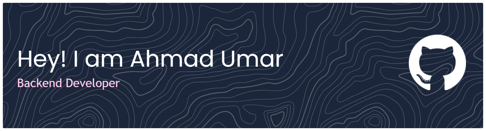

### Backend Developer | Spring Boot | Open Source Enthusiast
---

## ️ Tech Stack & Arsenal

**Primary Stack**

  
  
  
  
  

**Tools & Secondary Skills**

  
  
  
  
  

##  GitHub Stats

    <a href="https://github.com/doesDeveloper?tab=repositories">
        
         
        
        
    </a>

---

##  Featured  Build
###  ResourceHub
**Status:**  

> A production-grade distributed content platform designed for university resource sharing. Architected with a decoupled **Spring Boot** backend and **Svelte** frontend, featuring global exception handling and role-based security.

 

| Component | Tech Stack | Source Code | Live Link |
| :--- | :--- | :--- | :--- |
| **Backend** |    | [**View Backend Repo**](https://github.com/doesDeveloper/ResourceHubBackend)  | [**Backend API**](https://resourcehubbackend.onrender.com/api-docs.html) ️ |
| **Frontend** |   | [**View Frontend Repo**](https://github.com/doesDeveloper/ResourceHubFrontend)  | [**Frontend Web**](https://resource-hub-pi.vercel.app/)  |

 

---